<div align="center">

# Causal Impact of Bihar's 2016 Alcohol Prohibition

### A Synthetic Control & Bayesian Structural Time Series Analysis

**HST-102 Time Series Analysis · BS-MS Economics · IIT Roorkee · May 2026**

[](https://github.com/amsorrytola/scm-policy-india-)
[](https://github.com/amsorrytola/scm-policy-india-)
[](https://github.com/amsorrytola/scm-policy-india-)
[](https://github.com/amsorrytola/scm-policy-india-)
[](https://github.com/amsorrytola/scm-policy-india-)
[](LICENSE)

[**Live Website**](https://scm-policy-india.vercel.app) · [**Presentation (PDF)**](presentation/slides.pdf) · [**Notebooks**](notebooks/) · [**API Docs**](api/)

</div>

---

## Author

**Mohammed Talha Ansari** · Roll No. **23322016** · BS-MS Economics
Department of Humanities and Social Sciences · Indian Institute of Technology Roorkee
📧 `mohammed_ta@hs.iitr.ac.in` · 🐙 `github.com/amsorrytola`

---

## Table of Contents

1. [Abstract](#abstract)
2. [The Policy and the Causal Question](#the-policy-and-the-causal-question)
3. [Three Research Questions](#three-research-questions)
4. [Project Architecture](#project-architecture)
5. [Data — Sources, Acquisition, and Construction](#data--sources-acquisition-and-construction)
6. [Methodology](#methodology)
7. [Results](#results)
8. [Robustness Checks](#robustness-checks)
9. [Cross-Outcome Synthesis](#cross-outcome-synthesis)
10. [Limitations](#limitations)
11. [Interactive Companion Website](#interactive-companion-website)
12. [Repository Structure](#repository-structure)
13. [Reproduction Steps](#reproduction-steps)
14. [References](#references)

---

## Abstract

On April 5, 2016, the state of Bihar enacted **total prohibition** on the manufacture, sale, storage, and consumption of alcohol — making it the largest sub-national prohibition by population (~120 million people) in modern history. This project estimates the causal effect of that policy on three outcomes: **road accident deaths, state own-tax revenue, and per-capita NSDP growth.**

Identification uses **Synthetic Control Method** (Abadie, Diamond & Hainmueller 2010, 2015) as the primary strategy and **Bayesian Structural Time Series** (Brodersen et al. 2015) as a triangulating Bayesian alternative. The treated unit is Bihar; the donor pool is 13 other major Indian states; the analysis window is 2010-2022 (annual data).

**Headline finding:** Prohibition produced a statistically meaningful short-run reduction in road-accident deaths in 2016-2017 (≈900 lives saved per year, p ≈ 0.071, rank 2 of 14 in the permutation distribution), but **the effect fully reversed by 2018-2019** as illicit alcohol markets emerged. Bihar exceeded its synthetic counterfactual by +1,826 deaths per year by 2022. The fiscal cost is at least ₹2,017 Cr/year (a lower bound on the true excise loss). The growth effect is directionally negative (≈3 pp/year) but not statistically significant.

Beyond the empirical analysis, the project ships an **interactive companion website** with live SCM refit, Bayesian-grounded LLM Q&A (Gemini 2.5 Flash), and downloadable results — making every claim in this README independently verifiable.

---

## The Policy and the Causal Question

### Why this case is methodologically interesting

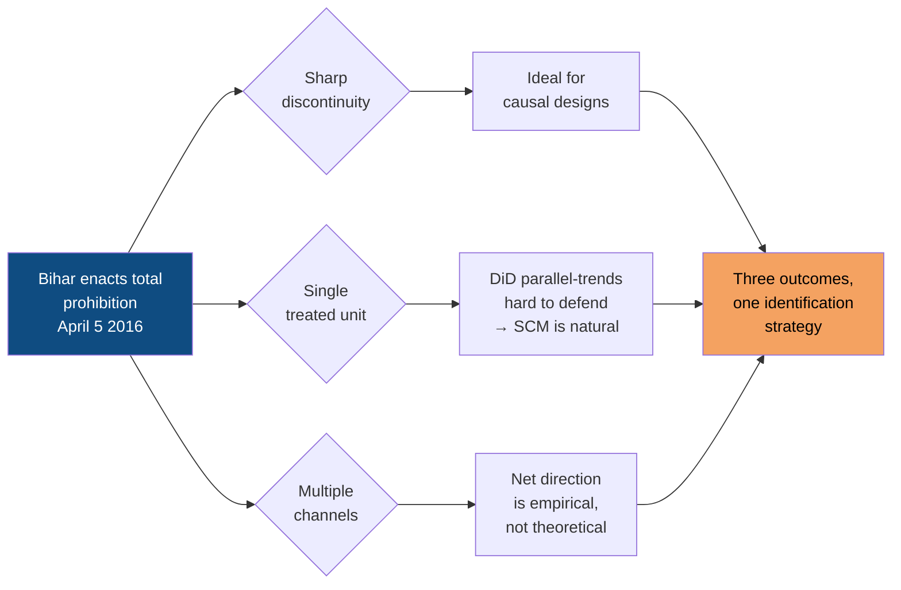

**The causal problem.** Raw data show Bihar's road-accident deaths rose 44% after prohibition. So did deaths in every other Indian state — vehicle stock grew nationally. The relevant comparison is not Bihar's before vs after, but **Bihar after prohibition vs the Bihar that would have existed without prohibition.** That counterfactual is unobservable. SCM constructs it as a weighted average of donor states whose pre-2016 trajectory tracks Bihar's.

---

## Three Research Questions

| # | Question | Outcome variable | Source |
|---|----------|------------------|--------|
| **Q1** | Did prohibition reduce road-accident deaths relative to a counterfactual Bihar that did not enact prohibition? | `road_accident_deaths` | MoRTH PDFs 2010-2023 |
| **Q2** | Did prohibition reduce state own-tax revenue via the loss of the excise component? | `own_tax_revenue_cr` | RBI Handbook T168 |
| **Q3** | Did prohibition accelerate or depress per-capita NSDP growth relative to comparable states? | `nsdp_growth_yoy` | RBI Handbook T19 (computed) |

Each outcome isolates a distinct welfare dimension — Q1 the intended public-health gain, Q2 the direct fiscal cost, Q3 the net economic effect of competing channels.

---

## Project Architecture

The project is structured as four layers: **data**, **analysis**, **API**, and **frontend**. Every layer reads from the layer below it; results from the analysis layer are serialized to JSON and consumed by both the website and the LLM Q&A grounding context.

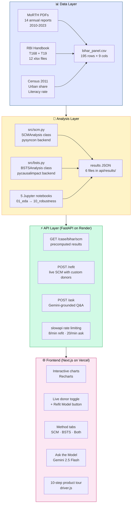

**Reproducibility guarantee:** every number on the website, in the slides, and in this README is generated by code in this repository. No manual transcription anywhere.

---

## Data — Sources, Acquisition, and Construction

### The processed panel

**`data/processed/bihar_panel.csv`** — 195 rows (15 states × 13 years, 2010-2022) × 9 columns. Telangana is excluded as a donor (only 2 pre-treatment observations after the 2014 bifurcation; degenerate Pearson correlation of exactly 1.0 with Bihar by mathematical constraint).

| Column | Type | Unit | Description | Source |
|--------|------|------|-------------|--------|
| `unit` | str | — | Indian state name | — |
| `date` | date | YYYY-01-01 | Calendar year as ISO date | — |
| `road_accident_deaths` | int | count | Persons killed in road accidents | MoRTH |
| `own_tax_revenue_cr` | float | ₹ Crore | State own-tax revenue (composite) | RBI T168 |
| `nsdp_pc_current_inr` | float | ₹ | NSDP per capita at current prices | RBI T19 |
| `urban_share_pct` | float | % | Urban population share | Census 2011 + interp. |
| `literacy_rate_pct` | float | % | Literacy rate (age 7+) | Census 2011 + interp. |
| `nsdp_growth_yoy` | float | % | YoY growth of NSDP per capita | Computed |

### Data acquisition pipeline

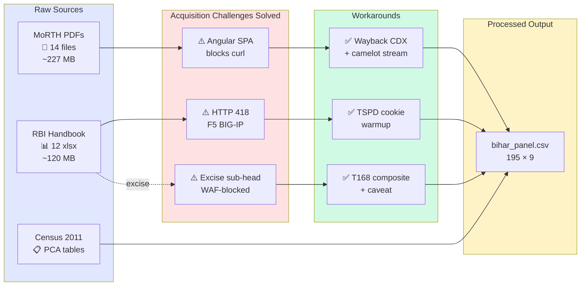

### Acquisition challenges — and how we solved them

#### Challenge 1: MoRTH PDFs blocked by Angular SPA
**Problem:** Direct URLs to `morth.nic.in/sites/default/files/*.pdf` returned 40 KB HTML instead of PDFs — the site routes everything through a Single Page Application shell that intercepts `curl` and `wget`.
**Solution:** Used the **Wayback Machine CDX API** to find archived snapshots of each annual report. Discovered a typo in the original 2018 filename (`Road_Accidednt.pdf` — sic). **Camelot stream mode** (not lattice mode) was required to extract state-wise tables across years where layouts changed.

#### Challenge 2: RBI anti-bot protection
**Problem:** `rbi.org.in` deploys F5 BIG-IP cookie protection. Direct Excel downloads returned **HTTP 418 (I'm a teapot)** — generic bot rejection.
**Solution:** Implemented two-step **TSPD cookie warmup**: first fetch the landing page to capture the session token, then replay that token in the Excel download header. All 12 RBI Handbook tables retrieved successfully.

#### Challenge 3: No excise sub-head data
**Problem:** State-wise alcohol excise duties appear only in RBI State Finances PDF appendices. Pre-2023 editions returned HTTP 418 for all bypass attempts.
**Solution:** Used **Table T168 (composite own-tax revenue)** with explicit attenuation caveat. Excise constituted 22-25% of Bihar's pre-prohibition own-tax. The estimated fiscal effect is therefore a **lower bound** on the true impact.

> Full provenance log including exact URLs, access dates, and filename mappings: [`data/raw/bihar/SOURCES.md`](data/raw/bihar/SOURCES.md)

---

## Methodology

### Synthetic Control Method (SCM)

For treated unit $i = 1$ (Bihar) and $J = 13$ donors, we choose weights $\mathbf{w} = (w_2, \ldots, w_{J+1})^\top$ that solve:

$$\mathbf{w}^* = \arg\min_{\mathbf{w} \in \mathcal{W}} \left\| X_1 - X_0 \mathbf{w} \right\|_V \quad \text{subject to} \quad w_j \geq 0, \quad \sum_j w_j = 1$$

where $X_1$ is Bihar's predictor vector, $X_0$ the $K \times J$ donor matrix, and $V$ a diagonal predictor-importance matrix chosen to minimize pre-period MSPE.

**The synthetic counterfactual:** $\hat{Y}^{(0)}_{1t} = \sum_j w^*_j Y_{jt}$
**Treatment effect:** $\hat{\tau}_t = Y_{1t} - \hat{Y}^{(0)}_{1t}$
**Inference:** Permutation-based placebo test (no asymptotic assumptions).

### The convex hull problem and its fix

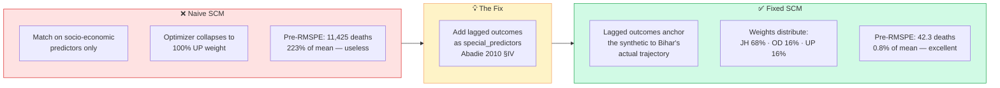

**Why this matters.** Bihar's NSDP per capita and urbanization rate are roughly 30% of the donor average. Bihar lies near or outside the convex hull of donor predictors (Abadie 2021, JEL §4). When the optimizer cannot match Bihar's predictor profile with any convex combination of donors, it collapses to the nearest "corner" — Uttar Pradesh — and assigns all weight there. Adding each pre-treatment year's outcome value as a `special_predictor` in `pysyncon`'s `Dataprep` forces the synthetic to match Bihar's **level** (~5,100 deaths/year) directly. **270× improvement in pre-period fit.**

### Bayesian Structural Time Series (BSTS)

Brodersen et al. (2015) decompose the observed series as:

$$y_t = \mu_t + \tau_t + \boldsymbol{\beta}^\top \mathbf{x}_t + \varepsilon_t$$

- $\mu_t$: local-level trend (random walk with drift)
- $\tau_t$: seasonality (omitted — annual data)
- $\boldsymbol{\beta}^\top \mathbf{x}_t$: regression on donor outcomes with spike-and-slab priors
- $\varepsilon_t \sim \mathcal{N}(0, \sigma^2)$

**Why BSTS triangulates with SCM:**
- Different functional form (linear regression with priors vs convex average) → different mis-specification risks
- Yields full posterior → credible intervals
- **Caveat:** with $n_{\text{pre}} = 6 \ll J = 13$ the regression overfits → restrict to top-$k$ donors via correlation (`max_donors=3`, following Brodersen §3.2)

### Why both methods?

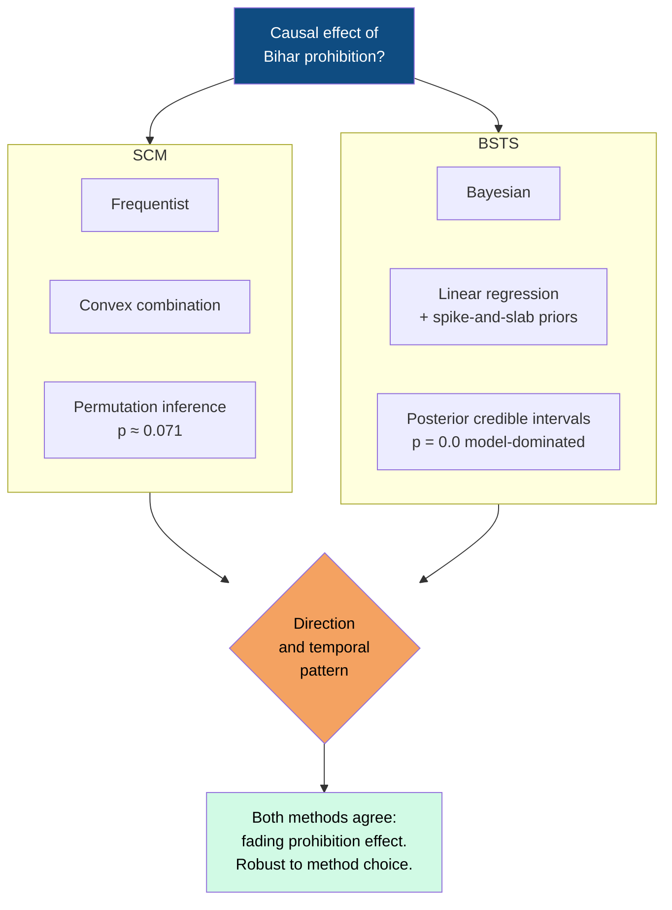

---

## Results

### Outcome 1: Road accident deaths (primary)

<div align="center">

| Metric | SCM | BSTS |
|--------|------|------|
| **Avg post-treatment effect** | **+360 deaths/yr** | **+1,076 deaths/yr** |
| **Pre-RMSPE** | 42.3 deaths (0.8% of mean) | — |
| **RMSPE ratio (post/pre)** | **22.87×** | — |
| **Permutation rank** | **2 of 14** | — |
| **p-value** | **≈ 0.071** | 0.0 (model-dominated) |
| **Donor weights** | JH 0.68 · OD 0.16 · UP 0.16 | Haryana · Odisha · WB |

</div>

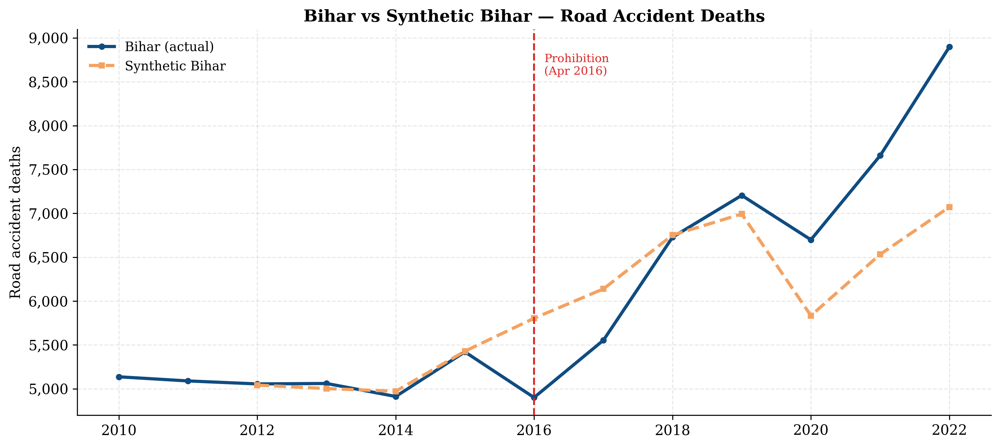

**Year-by-year story:**

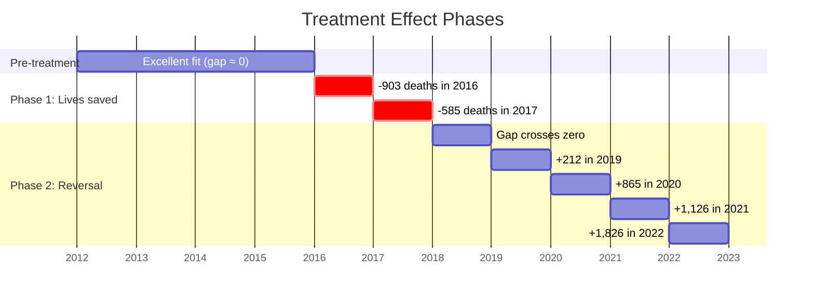

| Year | Bihar | Synthetic | Gap | Phase |
|------|-------|-----------|-----|-------|
| 2012 | 5,056 | 5,042 | +14 | pre (perfect fit) |
| 2013 | 5,061 | 5,003 | +58 | pre |
| 2014 | 4,913 | 4,972 | -59 | pre |
| 2015 | 5,421 | 5,429 | -8 | pre |
| **2016** | **4,901** | **5,804** | **-903** | 🟢 lives saved |
| **2017** | **5,554** | **6,139** | **-585** | 🟢 lives saved |
| 2018 | 6,729 | 6,752 | -23 | reversal point |
| 2019 | 7,205 | 6,993 | +212 | 🔴 above counterfactual |
| 2020 | 6,699 | 5,834 | +865 | 🔴 above counterfactual |
| 2021 | 7,660 | 6,534 | +1,126 | 🔴 above counterfactual |
| 2022 | 8,898 | 7,072 | **+1,826** | 🔴 above counterfactual |

**Interpretation:** Two-phase fading effect. Initial compliance produced a real public-health gain in 2016-2017. By 2018 the effect crossed zero; by 2022 Bihar was substantially worse than its counterfactual. Consistent with **illicit-market substitution and weakening enforcement** — and with Chaudhuri & Jha (2024, *Economic Development and Cultural Change*) using a similar causal design.

### Outcome 2: Own tax revenue

<div align="center">

| Metric | Value |
|--------|-------|
| **Avg post-treatment SCM gap** | **−₹2,017 Cr/yr** |
| **Pre-RMSPE** | ₹1,091 Cr |
| **RMSPE ratio** | 3.16× |
| **Donor weights** | Jharkhand 0.84 · UP 0.16 |
| **BSTS estimate** | −₹4,867 Cr/yr |

</div>

> ⚠️ **Important caveat: this is an attenuated proxy.**
> RBI Table T168 reports total own-tax revenue — a **composite** of excise + sales tax/VAT + GST compensation + stamps + vehicle tax. Excise constituted 22-25% of Bihar's pre-prohibition own-tax. Non-excise components grew strongly post-2016, **partially masking the excise collapse**. Bihar's actual state excise: ~₹4,000 Cr (2015-16) → ~₹500 Cr (2017-18). The SCM gap of ~₹2,017 Cr/yr should be read as a **lower bound** on the actual fiscal cost.

### Outcome 3: Per-capita NSDP growth

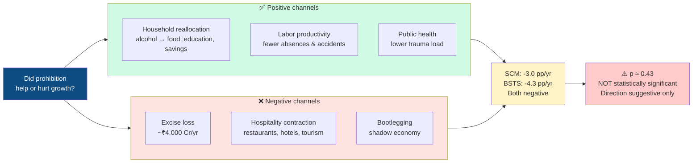

<div align="center">

| Metric | SCM | BSTS |
|--------|------|------|
| **Avg post-treatment effect** | **−2.99 pp/yr** | **−4.28 pp/yr** |
| **Permutation rank** | 6 of 14 | — |
| **p-value** | **≈ 0.43** (not significant) | 0.0 (single-donor) |
| **Donor weights** | Odisha 0.66 · Rajasthan 0.32 · JH 0.03 | Odisha (single) |

</div>

**Methodological note for BSTS growth:** Treatment date shifted to **2017-01-01** (calendar 2016 had only 8 months of prohibition; `pycausalimpact` requires ≥4 pre-periods). Even with `max_donors=3`, the BSTS overfit catastrophically (predicted growth of -172% in 2021); only the single-donor Odisha specification was numerically stable.

**Honest framing:** Both methods point to Bihar growing ~3-4 pp/year slower than the counterfactual. **Direction is consistent with negative-channel dominance; significance is not established.**

---

## Robustness Checks

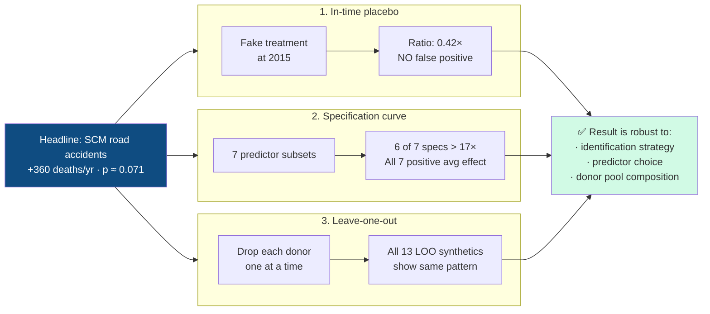

### In-time placebo
**Method:** Truncate the data and refit SCM as if treatment occurred in 2015. If the method produces large effects at fake dates, the design has a false-positive problem.
**Result:** Fake 2015 → RMSPE ratio **0.42×** (vs 22.87× for the real 2016). No false positive.

### Specification curve
**Method:** All 7 non-empty subsets of the 3 socioeconomic predictors.
**Result:** **6 of 7** specifications produce RMSPE ratios > 17×. **All 7** produce a positive average post-treatment effect (Bihar above synthetic). Average effects in the range +354 to +469 deaths/year (excluding the literacy-only outlier).

### Leave-one-out
**Method:** Drop each donor in turn and refit.
**Result:** All 13 LOO refits trace nearly identical synthetic Bihar trajectories. **Even dropping the dominant Jharkhand weight (68%)** produces a materially identical synthetic.

---

## Cross-Outcome Synthesis

<div align="center">

| Outcome | Method | Avg Effect | RMSPE Ratio | Rank | p-value |
|---------|--------|-----------:|:-----------:|:----:|:-------:|
| Road accident deaths | SCM | **+360 deaths/yr** | **22.87×** | **2/14** | **≈ 0.071** ✅ |
| Road accident deaths | BSTS | +1,076 deaths/yr | — | — | 0.0† |
| Own tax revenue | SCM | −₹2,017 Cr/yr | 3.16× | — | — |
| Own tax revenue | BSTS | −₹4,867 Cr/yr | — | — | 0.0† |
| NSDP growth | SCM | −2.99 pp/yr | 83.86× | 6/14 | 0.43 |
| NSDP growth | BSTS | −4.28 pp/yr | — | — | 0.0† |

</div>

> † BSTS p-values are model-dominated, not data-driven, given $n_{\text{pre}} = 6$. The SCM permutation $p$ is the preferred inference statistic.

### What we can claim
- ✅ **Significant short-run reduction in road deaths (2016-2017)** — rank 2/14, p ≈ 0.071
- ✅ **Composite tax gap consistent with ~₹4,000 Cr excise loss** (lower bound)
- ✅ **Three outcomes paint a coherent picture** — direction agrees across SCM and BSTS

### What we cannot claim
- ❌ **Long-run reduction in road deaths** — the effect reverses sharply by 2018
- ❌ **Pure-excise impact** — the proxy attenuates
- ❌ **Statistically significant growth effect** (p ≈ 0.43)

---

## Limitations

### Data
- **NSDP T19 starts FY 2011-12** → only 4 pre-period years for the matching window
- **Census 2021 delayed** → predictors interpolated linearly from 2011 anchor (low discriminating power)
- **Excise sub-head WAF-blocked** → composite proxy attenuates fiscal effect

### Identification
- **Bihar near edge of donor convex hull** → fixed via lagged outcomes, residual extrapolation bias possible
- **COVID-19 (2020-21) confounds post-2020 estimates** for all outcomes
- **Inter-state migration not captured** in the panel

### Method
- **BSTS overfits** ($n_{\text{pre}} = 6 < J = 13$) → `max_donors=3` is a subjective restriction
- **Growth BSTS uses single donor + 2017 cutoff** → different specification from level outcomes
- **Permutation $p$ from $J = 14$ is coarse** ($\geq 1/14 \approx 0.071$ minimum)

> **Honest framing:** Bihar is a hard SCM case — short pre-period, outlier on covariates, COVID confounder. Triangulating SCM and BSTS is the strongest defence we can mount given the data constraints.

---

## Interactive Companion Website

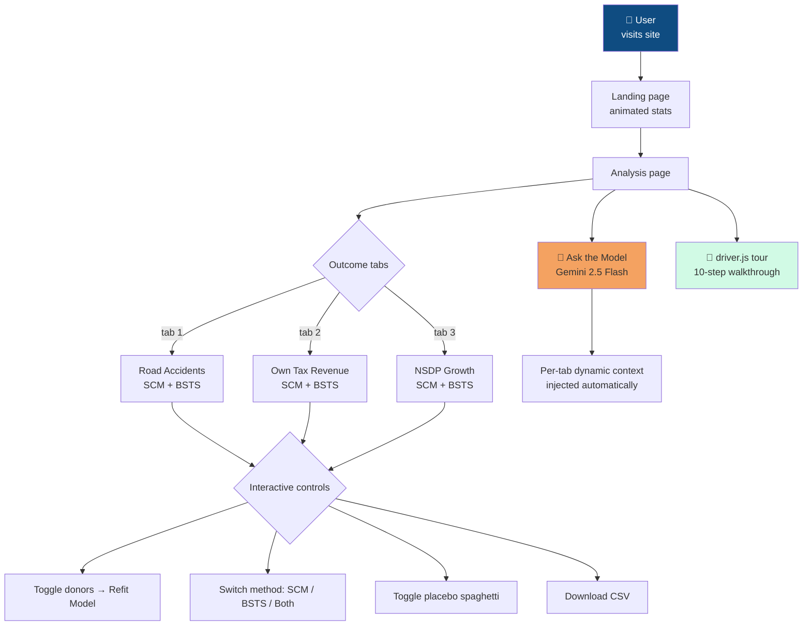

### Key features

| Feature | Description |
|---------|-------------|
| **Live SCM refit** | Toggle donors on/off, click *Refit Model* — SCM recalculates server-side with the new pool in real time |
| **Three outcome tabs** | Each with own SCM, BSTS, gap chart, placebo, donor weights, predictor balance |
| **Method toggle** | Switch SCM / BSTS / Both — charts and comparison panel update instantly |
| **Year-by-year results table** | Color-coded effects (green = lives saved, red = exceeded counterfactual) |
| **Ask the Model** | Gemini 2.5 Flash Q&A grounded in actual JSON results. **Context switches per outcome tab.** |
| **CSV downloads** | SCM gaps, BSTS effects, panel data — all exportable |
| **Product tour** | 10-step `driver.js` walkthrough auto-launches on first visit |
| **Keyboard shortcuts** | `r` = refit · `p` = placebos · `/` = focus ask box |

### API endpoints

```
GET  /api/case/bihar                    # Case metadata + config
GET  /api/case/bihar/scm                # Precomputed SCM (road accidents)
GET  /api/case/bihar/scm/tax            # Own tax SCM
GET  /api/case/bihar/scm/growth         # NSDP growth SCM
GET  /api/case/bihar/bsts               # BSTS road accidents
GET  /api/case/bihar/bsts/tax           # BSTS own tax
GET  /api/case/bihar/bsts/growth        # BSTS NSDP growth
POST /api/case/bihar/refit              # Live SCM refit (8/min limit)
POST /api/ask                           # Gemini Q&A (20/min limit)
```

### Tech stack

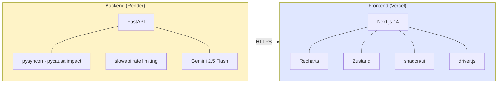

---

## Repository Structure

```
scm-policy-india/
├── 📊 data/
│   ├── raw/bihar/                              # Raw extraction outputs (tracked)
│   │   ├── SOURCES.md                          # Full provenance log
│   │   ├── morth_road_accidents_extracted.csv
│   │   ├── rbi_t168_own_tax_revenue.csv
│   │   ├── rbi_t19_nsdp_pc_current.csv
│   │   ├── census_predictors.csv
│   │   └── pdfs/, *.xlsx                       # Source files
│   ├── processed/
│   │   └── bihar_panel.csv                     # 195 × 9 analysis-ready panel
│   └── README.md                               # Data dictionary
│
├── 📓 notebooks/
│   ├── 01_eda_bihar.ipynb                      # Donor selection, EDA
│   ├── 05_scm_bihar.ipynb                      # SCM road accidents + tax
│   ├── 07_scm_bihar_growth.ipynb               # SCM + BSTS growth
│   ├── 09_bsts_bihar.ipynb                     # BSTS road accidents + tax
│   ├── 10_robustness_bihar.ipynb               # In-time placebo + spec curve
│   └── README.md                               # Methodology document
│
├── 🐍 src/
│   ├── scm.py                                  # SCMAnalysis class (pysyncon)
│   ├── bsts.py                                 # BSTSAnalysis class (max_donors)
│   ├── plotting.py                             # Publication-style helpers
│   └── data_loaders.py                         # MoRTH/RBI extraction
│
├── ⚡ api/
│   ├── main.py                                 # FastAPI app
│   ├── models.py                               # Pydantic schemas
│   ├── routers/bihar.py                        # Endpoint definitions
│   ├── services/scm_service.py                 # SCM business logic
│   ├── services/gemini_service.py              # Gemini per-outcome context
│   └── results/                                # 6 precomputed JSON files
│
├── 🌐 web/                                     # Next.js 14 frontend
│   ├── app/                                    # App Router pages
│   ├── components/                             # React components
│   ├── lib/api.ts                              # API client
│   └── lib/store.ts                            # Zustand state
│
├── 📈 results/
│   ├── figures/                                # 19 PNG figures
│   └── tables/                                 # CSV summary tables
│
├── 🎨 presentation/
│   └── slides.pdf                              # 26-slide LaTeX Beamer
│
├── 📚 papers/                                  # 8 reference PDFs (Abadie, Brodersen, etc.)
└── 🛠 scripts/                                  # One-off pipeline scripts
```

---

## Reproduction Steps

```bash
# 1. Clone
git clone https://github.com/amsorrytola/scm-policy-india-.git
cd scm-policy-india-

# 2. Python environment (3.10 or 3.11)
python -m venv venv
source venv/bin/activate          # Windows: venv\Scripts\activate
pip install -r requirements.txt

# 3. Re-run analysis (executes notebooks in order)
jupyter nbconvert --to notebook --execute notebooks/01_eda_bihar.ipynb
jupyter nbconvert --to notebook --execute notebooks/05_scm_bihar.ipynb
jupyter nbconvert --to notebook --execute notebooks/09_bsts_bihar.ipynb
jupyter nbconvert --to notebook --execute notebooks/10_robustness_bihar.ipynb
jupyter nbconvert --to notebook --execute notebooks/07_scm_bihar_growth.ipynb

# 4. Run backend (FastAPI, http://localhost:8000)
cd api
export GEMINI_API_KEY="your-key-here"  # for /ask endpoint (optional)
uvicorn main:app --reload

# 5. Run frontend (Next.js, http://localhost:3000)
cd ../web
npm install
npm run dev
```

**Verify the panel:**
```python
import pandas as pd
panel = pd.read_csv("data/processed/bihar_panel.csv", parse_dates=["date"])
assert panel.shape == (195, 9)
assert panel["unit"].nunique() == 15
assert panel["date"].dt.year.between(2010, 2022).all()
print("✅ Panel OK")
```

---

## References

### Methodology
1. Abadie, A., Diamond, A., & Hainmueller, J. (2010). Synthetic Control Methods for Comparative Case Studies. *Journal of the American Statistical Association*, 105(490), 493-505.
2. Abadie, A., Diamond, A., & Hainmueller, J. (2015). Comparative Politics and the Synthetic Control Method. *American Journal of Political Science*, 59(2), 495-510.
3. Abadie, A. (2021). Using Synthetic Controls: Feasibility, Data Requirements, and Methodological Aspects. *Journal of Economic Literature*, 59(2), 391-425.
4. Brodersen, K. H., Gallusser, F., Koehler, J., Remy, N., & Scott, S. L. (2015). Inferring Causal Impact Using Bayesian Structural Time-Series Models. *Annals of Applied Statistics*, 9(1), 247-274.
5. Doudchenko, N., & Imbens, G. W. (2016). Balancing, Regression, Difference-in-Differences and Synthetic Control Methods. *NBER Working Paper* 22791.

### Application
6. Chaudhuri, K., & Jha, N. (2024). Alcohol Ban and Crime: The ABCs of the Bihar Prohibition. *Economic Development and Cultural Change*, 72(4).

### Data
7. Reserve Bank of India. *Handbook of Statistics on Indian States, 2024-25*. Tables T19, T168. https://www.rbi.org.in
8. Ministry of Road Transport & Highways. *Road Accidents in India* — Annual Reports 2010-2023. Government of India. https://morth.nic.in
9. Census of India 2011. *Primary Census Abstract*. Office of the Registrar General. https://censusindia.gov.in

---

## Acknowledgements

- **Course:** HST-102 Time Series Analysis, IIT Roorkee
- **Programme:** BS-MS Economics, Department of Humanities and Social Sciences

---

## License

MIT License — see [LICENSE](LICENSE) file for details.

---

<div align="center">

**Mohammed Talha Ansari** · `23322016` · BS-MS Economics · IIT Roorkee
HST-102 Time Series Analysis · May 2026

[⬆ Back to top](#causal-impact-of-bihars-2016-alcohol-prohibition)

</div>